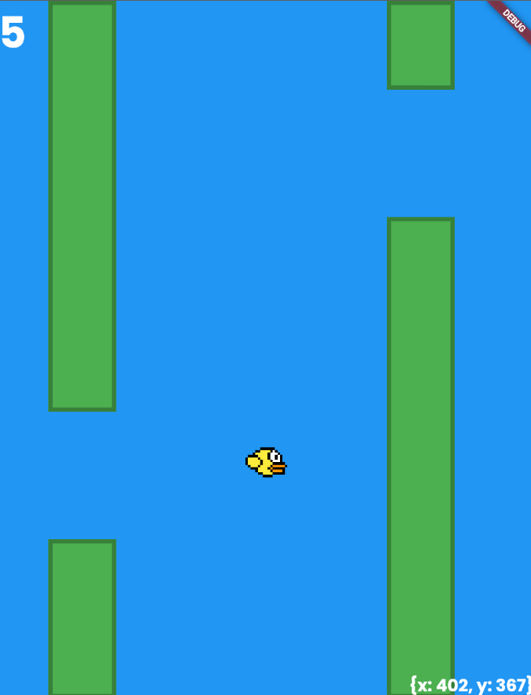

Flappy bird in [Flutter](https://flutter.dev/?gclid=CjwKCAjw2P-KBhByEiwADBYWCtIOYB_OONZuVbEwDSWKLQL81hln3zfjbvAYf5WuIfq3p1m5Wi0fqxoCPFkQAvD_BwE&gclsrc=aw.ds) ! 
From [flutter-dojo-flappybird](https://github.com/bamlab/flutter-dojo-flappybird).

# Addons from the main tuto :
* Collisions with pipes 💥
* Random pipes on y axis 🔀
* Pretty good responsivity 🕹️
* Score 📈

Full playable game 🎮

